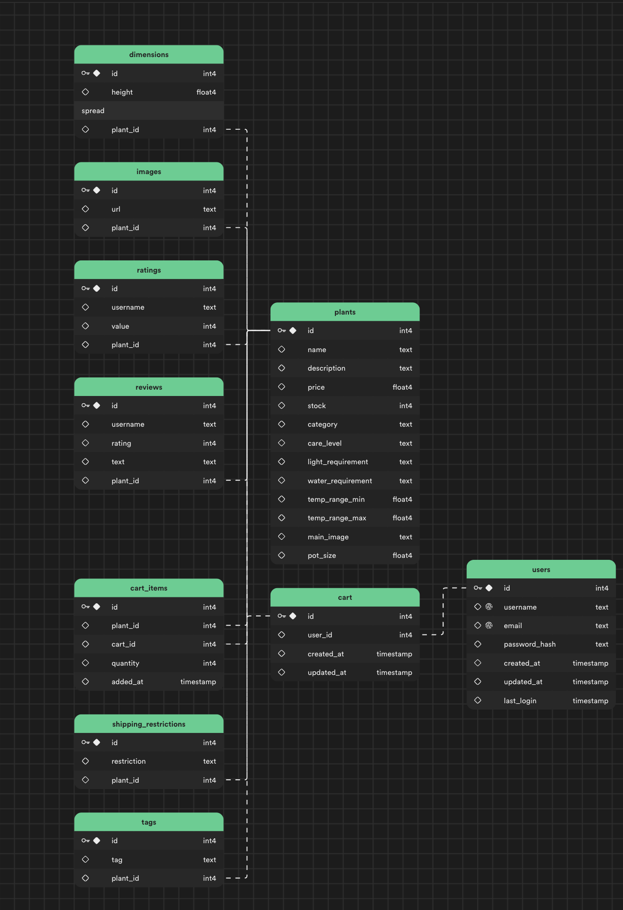

# Plant E-Commerce Application (ROŚLINY)

Core Stack:

- Typescript
- Next.js
- Tailwind
- Supabase

This is a personal project where the goal is to go from design -> deployed application of an eCommerce application using some newer technologies.

V1: Barebones application:

- non-functional checkout
- simple log-in and sign-in
- plant information comes from supabase data
- sleek UI with complex carousels and styling

V2: Stripe Integration

- Functional checkout experience

V3: Product Search & Admin Interface (TBD)

- Search all products via search bar
- Access admin interface to modify item information
